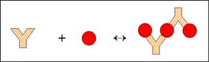
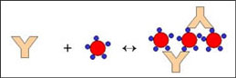
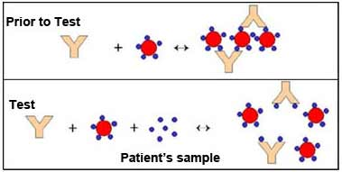

### Principle

 

Latex agglutination is observed when a sample containing the specific antigen (or antibody) is mixed with an antibody (or antigen)  which is coated  on the surface of latex particles.

Latex agglutination tests have been applied in clinical laboratories for the detection of infectious diseases and in 1956 Singer and Plotz first described Rheumatoid Factor Test, a test based on latex agglutination. In rheumatoid arthritis (RA), IgG antibodies produced by lymphocytes in the synovial joint react with the IgM antibodies (RF, rheumatoid factor) to generate immune complexes that activate the complement and cause the tissue destruction. The RA is of diagnostic significance.

Since then, tests to detect microbial and viral infections, autoimmune diseases, hormones, drugs and serum proteins have been developed and marketed by many companies worldwide. The principle is used for the diagnosing many infections such as Hepatitis B, H.influenzae, N. meningitidis, etc.. All methods of detecting or quantitating antigen or antibody take advantage of the fact that they react to form a complex. At the optimum antigen-antibody concentration, this complex precipitates out. However, if the antigen is particulate in nature, agglutination of antigen-antibody complex is observed.

 
### Agglutination Reactions

 

The reaction  between a particulate antigen and an antibody results in visible clumping called agglutination. Antibodies that produce such reactions are known as agglutinins.  The principle of Agglutination reactions are similar  to precipitation reactions; they depend on the cross linking of polyvalent antigens. When the antigen is an erythrocyte it is called hemagglutination.Theoretically all antibodies can  agglutinate particulate antigens but IgM, due to its high specificity  is  a particularly good agglutinin.

 

There is no agglutination can be observed when the concentration of antibody is high, (lower dilutions), and then the sample is diluted, agglutination occurs. Prozone effect is defined as the invisibility of agglutination at high concentrations of antibodies. It is due to the reason that excess antibody forms very minute complexes that do not clump to form visible agglutination.

 
### Qualitative agglutination test

 

Agglutination tests can be used in a qualitative manner to assay for the presence of an antigen or an antibody. The antibody is mixed with the particulate antigen and a positive test is indicated by the agglutination of the particulate antigen.

 

For example, to determine patient’s blood type the  red blood cells of the person can be mixed  with antibody to a blood group antigen. Another example is that to assay the presence of antibodies in a patient  sample, the serum of the patient is mixed with the red blood cell (RBC)  of a known blood type.

 

 

 
### Quantitative agglutination test

 

To measure the level of antibodies to particulate antigens, agglutination test can be widely used. For this test, serial dilutions of the sample can be made and it is tested for antibody. Then a fixed amount of particulate antigen or bacteria or red blood cells can be added to it. Determine the maximum dilution which forms agglutination and this maximum dilution which gives observable agglutination is known as the titer. The results is shown as the reciprocal of the maximum dilution that forms visible agglutination.

 
### Passive Hemagglutination

 

The sensitivity and simplicity of agglutination reactions can be extended to soluble antigens by the technique of passive heme agglutination. In this technique, antigen coated red blood cells are prepared by mixing a soluble antigen with a red blood cells that have been treated with tannic acid or chromium chloride, both of which promote adsorption of antigen to the surface of the cells. However, it is possible to coat erythrocytes with a soluble antigen (e.g.. viral antigen, a polysaccharide or a hapten) and use the coated red blood cells in an agglutination test for antibody to the soluble antigen.

 

Serially diluted serum which contain antibody is loaded to each well of the microtiter plate, after that antigen coated red blood cells is applied to each well. The characteristic pattern of agglutinated red blood cells on the wells is used as a tool for assaying the agglutination reactions. If  the antigen is particulate, then the antigen  can react with the antibody in the serum  and results in the clumping of antigen which shows a positive result.

 

Over the past several years, there has been a shift away from red blood cells to synthetic particles, such as latex beads. The preparation can either be used immediately or stored for later use. The use of synthetic beads offers the advantages of consistency, uniformity, and stability. Furthermore, agglutination reactions employing synthetic beads can be read rapidly, often within 3 to 5 minutes of mixing the beads with the test sample. Whether based on red blood cells or the more convenient and versatile synthetic beads, agglutination reactions are simple to perform, do not require expensive equipment, and detect small amount of antibody ( concentrations as low as nanograms per millilitre).

The initial step in the test is the linking together of the latex particle by the antibody molecules that specifically attach to the antigenic determinants on the surface of the particles. There is a formation of large lattices through these cross links and these large lattices sediment readily due to the large size of clumps and are visible to the unaided eye within minutes. The degree of agglutination can be determined by plotting the aggutinant  concentration which gives a bell shaped curve. The antigen-antibody complexes can be magnified using the latex particles. Many of the latex agglutination tests are performed manually and  detected by visual observation. To determine agglutination there must contain about 100 clumps, and  these clumps must be of about 50 micrometer in size to be seen by eye.
 
### Agglutination Inhibition Reactions

 

If the antibody is incubated with antigen prior to mixing with latex, agglutination is inhibited; this is because free antibodies are not available for agglutination. In agglutination inhibition, the absence of agglutination is diagnostic of antigen, provides a high sensitive assay for small quantities of antigen. For example home pregnancy kits contain human chorionic gonadotropin (HCG hormone) coated latex particle and antibody to HCG. A pregnant woman urine contain HCG which is secreted  by the developing placenta after fertilization. The addition of urine containing HCG, inhibits agglutination of latex particles when the anti-HCG antibody is added; and  thus the pregnancy is indicated by the absence of agglutination.

 

 

 
 
 

 
 
 
### The Latex Particles

 

Emulsion polymerization is the procedure that is applied  for the preparation of latex particles. Firstly the styrene is mixed with the surfactant (sodium dodecyl sulfate) solution, forms a billions of emulsified micelles which are in uniform diameter. Then a little amount  of  potassium persulfate is added to it which is a water soluble  polymerization initiator. When the polymerization process is finished, the polystyrene chains are arranged into the  micelles. The hydrocarbon  part of the polystyrene chain is attached to the center and the terminal sulfate ion to the spheres  surface which is exposed to the water phase. Other hydrocarbons and its derivatives are also used for the production of the uniform latex particles, some of the examples are stryrene-dlvinylbenzene, polymethyl methacrylate, styrene vinyl toluene, polyvinyl toluene etc.

 

The process of latex particle production  is evolved from  synthetic rubber production and also the emulsion have a milky appearance, the term latex is given to it .The desired diameter of latex particle can be made by modifying the process of preparation, hydrocarbons, the surfactants and the initiator. The particle size of latexes are usually  ranges between 0.05µm to 2µm. Because of the presence of sulfate and sulfonate ions on the surface of the particle which  provides a inherent negative surface  charge to the particle.

 

The latex particles can be functionalized  and surface treated to facilitate the binding stability and to increase analyte attachment. Functional treatments such as amidation, amination, carboxylation, hydroxylation and even magnetization is used to increase the properties of latex particles. Also various colors of latex particles are available  commercially  which facilitate the visual read –out.

 

The  latex agglutination test is a clinical method to detect certain antigens or antibodies in a variety of bodily fluids such as blood, saliva, urine or cerebrospinal fluid. The sample to be tested is sent to the lab and where it mixed with latex beads coated with a specific antigen or antibody. The clumping of latex beads (agglutination) indicates the presence of suspected particles.

Latex agglutination test includes some of the advantages .They are,

1.    Ability to obtain semi quantitative results.
2.    A low individual test cost.
3.    Relatively short time to obtain results.

By performing 2- to 10-fold  dilutions of specimens  we can obtain the semi quantitative results .Latex  agglutination test have some disadvantages also  which include

1.Need to carefully interpret marginal results and
2.  Problems with specificity due to interfering substances in many assays.

 

 Positive result will show development of an agglutinated pattern showing clearly visible clumping of the latex particles. Negative result will show no agglutination and the milky appearance remains unchanged throughout the test .
 
